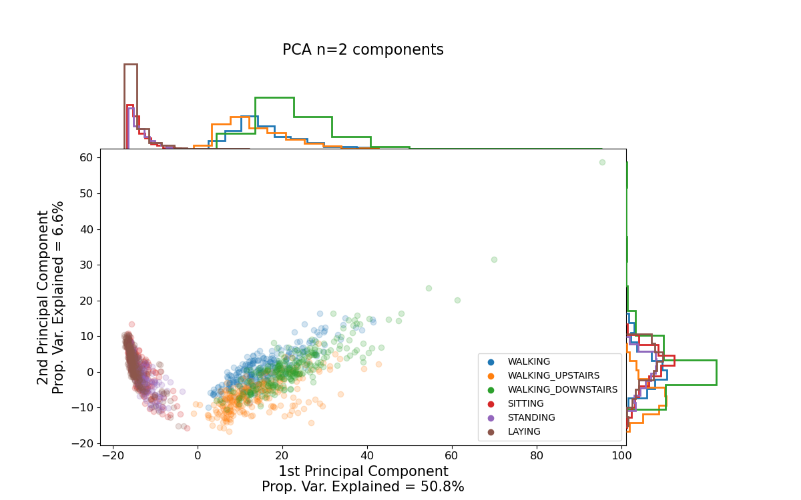
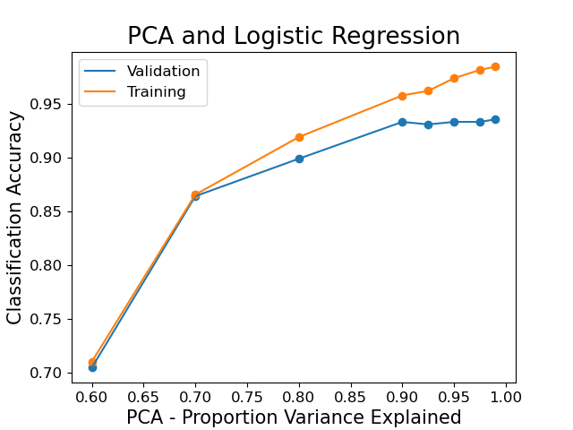
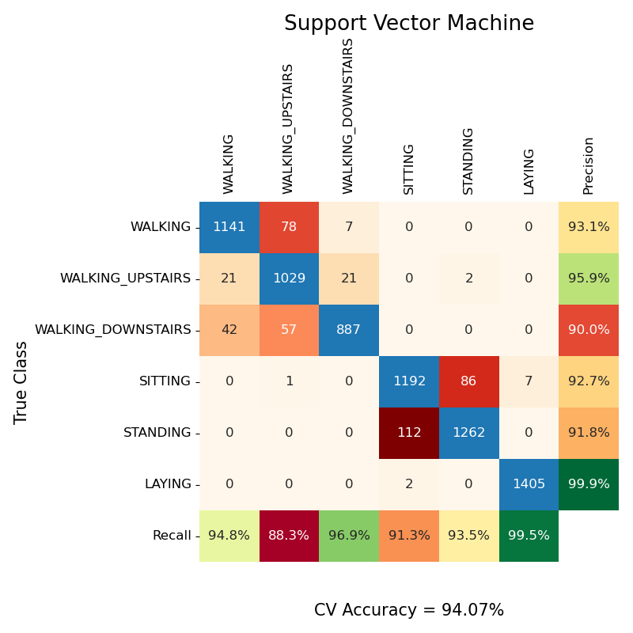

# Human Activity Recognition using Smartphone Sensors

**Andrew Berson and Tayden Li**

Stanford University - Stats 315B - Modern Applied Statistics: Data Mining

### 1. Introduction

Human activity recognition (HAR) involves using sensors, which are often either embedded in wearable devices or
held by individuals, to classify activities they are performing. 
HAR has many use cases related to both health and fitness. Using HAR, people can track their daily 
activities and better understand their physical health, such as the amount of exercise they complete each day. 
Being able to classify activities from sensors worn 
by subjects can also help alert healthcare workers and/or family members if an individual falls. 
Given the wide proliferation of smart-watches and smartphones, HAR can benefit many individuals.

In this project, we use statistical and machine learning approaches to predict human activity 
from data recorded by smartphones. We then compare the results from different models and conduct error analysis.

### 2. Data

#### 2.1 Data collection 

The data set used in this paper was generated at the University of Genoa by Anguita et al. (2013) \[1\], and the
data set can be downloaded [here](https://archive.ics.uci.edu/dataset/240/human+activity+recognition+using+smartphones). 
In the experiment, thirty volunteers aged 19-48 wore smartphones (Samsung Galaxy SII) on their waists. They 
then performed six activities: walking, walking upstairs, walking downstairs, sitting, standing, and laying. 
The embedded accelerometer and gyroscope recorded subjects' triaxial linear acceleration and angular speed at 
a rate of 50Hz. 70% of the subjects were randomly selected to be in the training set and the other 30% were 
selected to be in the test set.

#### 2.2 Data preprocessing

The sensor signals were noise-filtered and sampled in fixed-width sliding windows of 2.56 seconds with 50% 
overlap. Gravitational and body motion acceleration were separated with a Butterworth low-pass filter. Features 
were calculated from each window. The final data set contains 561 features and 10,299 observations across 30 subjects.

#### 2.3 Data visualization

Principal Component Analysis (PCA) is a dimensionality reduction method. In PCA, principal components are 
constructed such that the first component accounts for the largest possible variance in the features. 
Subsequent principal components are orthogonal to previous principal components and also account for less variance.
PCA works by first standardizing all features to a comparable scale. The covariance matrix as well 
as its eigenvectors and eigenvalues are then calculated. After sorting the eigenvectors by the magnitude of 
their eigenvalues, the principal components can be ranked by the amount of variance explained.

The figure below shows a clear separation of active (walking, walking upstairs, and walking downstairs) and 
sedentary (sitting, standing, laying) activities along the first principal component.

*2-d representation of data using PCA*

### 5. Methods

The methods summarized below were tuned using 5-fold Cross Validation (CV). The folds for CV were established 
such that none of the test subjects appear in multiple folds. In this way, we ensure that the CV results most 
accurately estimate the accuracy that would be achieved on a never-before-seen subject.

#### 5.1 Multinomial logistic regression (MLR) 

**Method** MLR generalizes logistic regression to multi-class classification tasks.

**Experiments** We performed two sets of experiments using MLR. In the first experiment, we used MLR after first 
reducing the dimensionality of the data set using PCA. In this experiment, the two parameters we tuned were the 
extent of dimensionality reduction as well as the L2 regularization parameter in MLR. We found that reducing the 
dimensionality of our data with PCA prior to fitting the model did not improve classification accuracy.

In the second experiment, we did not perform any dimensionality reduction, and instead only applied L2 
regularization. 

#### 5.1 Linear discriminant analysis (LDA)

**Method** LDA assumes that each class is drawn from a multivariate Gaussian distribution, where the means of each 
feature are specific to the class, but the covariance matrix is shared across all classes. Because the covariance 
matrix is shared across classes, the decision boundary is linear.

**Experiments** When forming the LDA model, shrinkage can be applied to the estimation of the covariance matrix. 
The shrinkage parameter scales the estimate of the covariance between different features. If the shrinkage parameter 
is set equal to 1, the covariance matrix will be diagonal and all features will be assumed to be uncorrelated. 
In contrast, if the shrinkage parameter is 0, the covariance matrix will equal the empirically calculated 
covariance matrix. Practically speaking, shrinkage is helpful when there are a limited number of observations. 
However, given that the number of observations in the data set is much greater than the number of features (n >> p), 
shrinkage did not improve model accuracy. Additionally, experiments were also performed where the LDA model was 
fit after reducing the dimensionality of the data set using PCA. However, similar to MLR, LDA performs worse 
when PCA is applied to reduce the data's dimensionality.

#### 5.2 Support vector machine (SVM)

**Method** SVM aims to find hyperplanes that can best divide data by their labels. A kernel is often applied to 
transform the data. Here, we used the RBF kernel. We experimented with various regularization strengths (*C*). We 
achieved a 94.29% CV accuracy with *C* equalling 166.8.

#### 5.3 Random Forest

**Method** Random forests ensemble multiple decisions trees trained in parallel with bagging. Bagging allows 
individual trees to be trained on subsets of training data that are randomly sampled with replacement. For any given 
tree, when deciding which feature to split on, we pick the one that decreases Gini impurity the most. 

Bagging, along with the fact that at each split only a random subset of features are considered, helps reduce the 
model variance. This tends to make random forests significantly more accurate than decision trees.

**Experiments** We tuned three different hyperparameters and obtained a CV accuracy of 91.58%.

### 6 Results and discussion

#### 6.1 Model selection 

Cross validation accuracies are displayed below:

| Method | CV Score |
| :--- |:----: |
| Support Vector Machine (SVM) | 94.07% |
| Multinomal Logistic Regression (MLR) | 93.74% |
| Linear Discriminant Analysis (LDA) | 93.72% |
| PCA & LDA | 92.59% |
| PCA & MLR | 91.95% |
| Random Forest | 91.58% |

#### 6.2 Error analysis

Throughout all models tested, the main sources of error was confusion within the following subgroups:
 - Walking, walking upstairs, and walking downstairs
 - Sitting and standing

This can be easily visualized in the confusion matrices.

#### 6.3 Performance on test set

The model that performed best in cross-validation was the Support Vector Machine. For this reason, SVM was chosen as
the model to use on the test set. Test set accuracy was measured at 96.3% using the the SVM model trained on the entire
training set.

### Conclusion
Given how widespread smart gadgets and smartphones are, predicting human activity with sensors on these devices may 
have widespread impact and applications. In our experiments, we found that SVM is the best at 
predicting human activity from the readings of gyroscopes and accelerometers. In addition, almost all models tested 
performed exceptionally well at separating the 6 classes into 3 groups—(walking, walking upstairs, walking 
downstairs), (sitting, standing), and (laying). However, they are less effective at differentiating classes within 
each of the three groups, likely because of similar data characteristics within groups.

#### References

\[1\] Anguita, D., Ghio, A., Oneto, L., Parra Perez, X., & Reyes Ortiz, J. L. (2013). A public domain dataset for 
human activity recognition using smartphones. In *Proceedings of the 21th international European symposium on 
artificial neural networks, computational intelligence and machine learning* (pp. 437-442).
